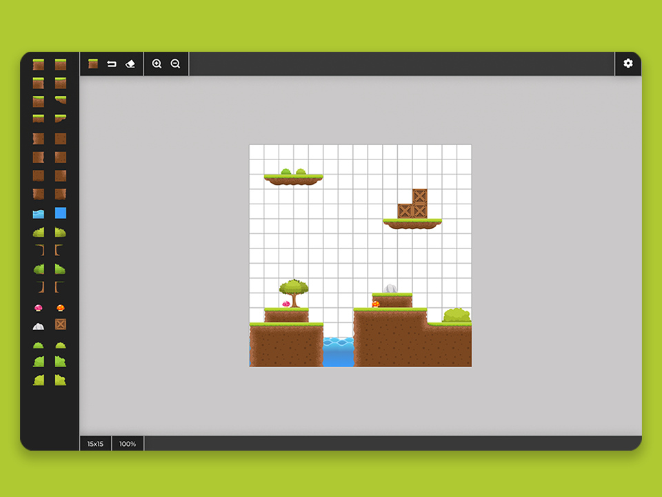

# Level Editor Project

Web-based editor designed for creating game levels with predefined assets.

## Project brief

Dive deep into the realm of game design and development with **Level Editor**. This web-based editor provides an intuitive platform for crafting engaging game levels with assets. Seamlessly integrate various game assets, utilize responsive zooming features, and ensure that your creations are preserved across sessions. Whether you're a seasoned developer or just stepping into the world of game design, Level Editor promises an immersive and enlightening experience.

### What you will learn

- **Intuitive UI Design**: Create a multi-faceted user interface that not only looks good but functions seamlessly. From asset bars to dynamic zoom indicators, you'll grasp the intricacies of sophisticated web design elements.

- **Advanced Grid Manipulation**: Delve into the world of grids, learning how to dynamically alter their sizes, integrate assets, and provide a responsive user experience at varying zoom levels.

- **Data Handling & Storage**: Learn the importance of persistently storing user creations, ensuring that their efforts aren't lost between sessions. Dive into exporting layouts to JSON and appreciate the power of data representation.

- **Interactive Asset Management**: Get hands-on experience with interactive elements such as hover descriptions, dynamic mouse cursors, and asset selection mechanisms.

### Requirements

- Implement a UI container based on the provided design that includes key elements: an assets vertical bar, a top bar, a content area with a background, an empty grid (15x15 initially), and a bottom bar.
- Enable the selection of assets from the left bar. When an asset is selected, it should be highlighted with a blue outline on the left bar. Change the mouse cursor to the chosen asset, allowing users to draw on the grid either by clicking or dragging. While placing assets, showcase an opacity effect to signify the potential asset position. Initially, no asset is selected, and no action occurs upon a mouse click until an asset is chosen.
- Integrate a "quick asset" feature on the top bar with a hover tooltip. Initially, the first asset serves as the "quick asset" since no drawing has been done. As users draw with an asset, update the "quick asset" to the recent one. Clicking on "quick asset" selects it and highlights it only on the left bar.
- Implement an undo mechanism that allows users to revert actions with a hover tooltip. It should be robust enough to revert back to the initial state (empty grid) without causing application issues. Extend support for keyboard shortcuts (ctrl/cmd + Z) for user convenience.
- Offer an eraser functionality that lets users click or drag to remove assets with a hover tooltip and a selected state. The cursor should dynamically switch to the eraser tool when activated. An opacity effect should also be displayed to indicate potential asset removal.
- Incorporate a zoom feature with a hover tooltip and selected states that start at 100%, capable of zooming in up to 150% and zooming out to 50%. The bottom bar indicators should dynamically display the current zoom level.
- Embed the settings icon with a hover tooltip and a selected state. Add a popup with the export-to-JSON feature on click, providing users the option to rename the file before downloading. The resulting file should represent the grid as a 2D array with 0-x values according to asset indexes.
- Facilitate the adjustment of a grid layout with a base size constraint. As users modify the grid's dimensions, the changes should immediately reflect both within the grid and on the bottom bar indicators.
- Implement a local storage mechanism to retain the user's level configuration, ensuring that their work persists after a page reload. If the user accesses the platform for the first time, present them with either an empty grid or a predefined level, based on creativity.

